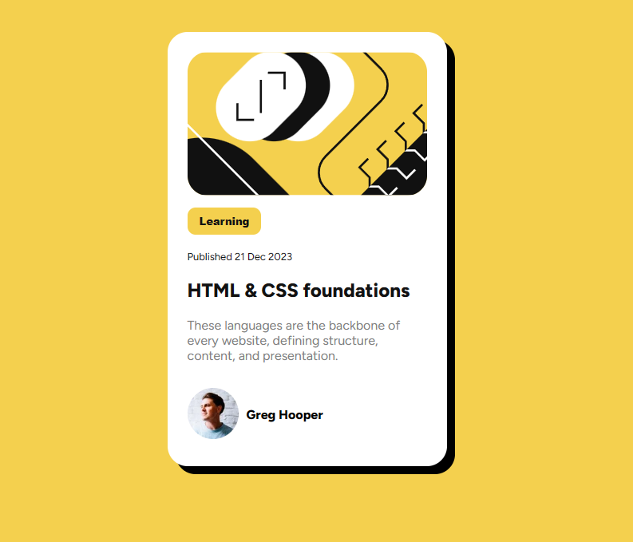

# Frontend Mentor - Blog preview card solution

This is a solution to the [Blog preview card challenge on Frontend Mentor](https://www.frontendmentor.io/challenges/blog-preview-card-ckPaj01IcS). Frontend Mentor challenges help you improve your coding skills by building realistic projects. 

## Table of contents

  - [Overview](#overview)
  - [The challenge](#the-challenge)
  - [Screenshot](#screenshot)
  - [Links](#links)
  - [Built with](#built-with)
  - [What I learned](#what-i-learned)
  - [Author](#author)

## Overview

### The challenge

Users should be able to:

- See hover and focus states for all interactive elements on the page, the interaction appears in the title and it changes the cursor to a pointer

### Screenshot

### Links

- Solution URL: [Blog_preview_card_FE](https://github.com/micaji-251/Blog_preview_card_FE)
- Live Site URL: [Add live site URL here](https://micaji-251.github.io/Blog_preview_card_FE/)

### Built with

- Semantic HTML5 markup
- CSS custom properties
- Flexbox
- Mobile-first workflow
- Pseudo-classes

### What I learned

I practiced the use of flexbox, and pseudoclasses to make a page change with user-interaction.

  .title:hover,.title:focus{
      color: hsl(47, 88%, 63%);
      cursor:pointer;
  }

## Author

- Frontend Mentor - [@micaji-251](https://www.frontendmentor.io/profile/micaji-251)
